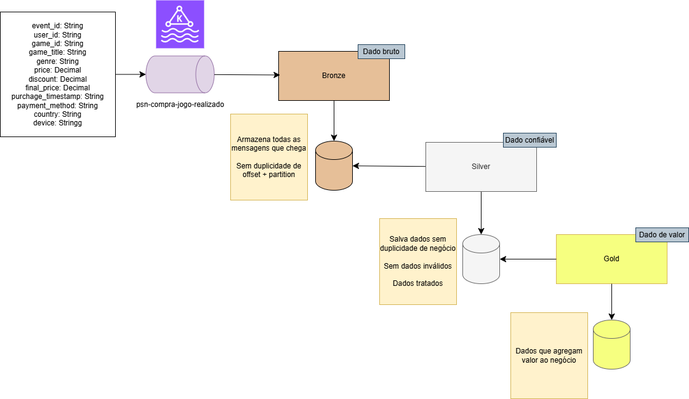
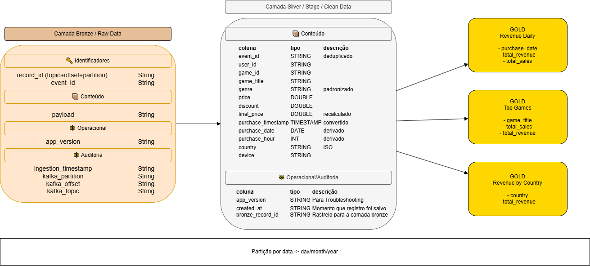

# 🎮 PSN Streaming Analytics Pipeline

Pipeline de dados em tempo real simulando compras de jogos na PSN, utilizando **Kafka + PySpark + Delta Lake**, seguindo o padrão **Medallion Architecture (Bronze, Silver, Gold)**.

---

## 🧱 Arquitetura

O sistema é composto por:

- **Kafka** → ingestão de eventos em tempo real  
- **Spark Structured Streaming** → processamento contínuo  
- **Delta Lake** → armazenamento confiável  
- **Medallion Architecture** → organização dos dados  
- **Camada Gold** → consumo por BI, APIs e ML  

---

## 🔄 Fluxo de Dados

1. Eventos de compra são gerados por um simulador da PSN  
2. Eventos são publicados no Kafka  
3. O Spark Streaming consome e processa os dados  
4. Dados passam pelas camadas:
   - 🥉 Bronze (raw)
   - 🥈 Silver (limpo)
   - 🥇 Gold (agregado)

---

##  Arquitetura

### Schema:

